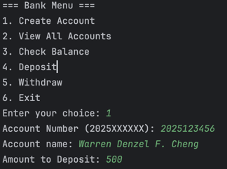
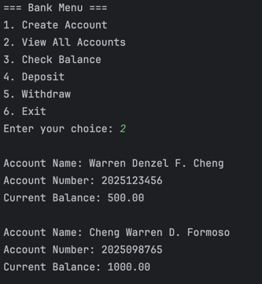
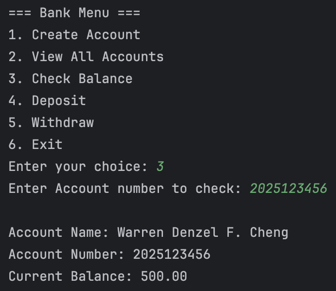
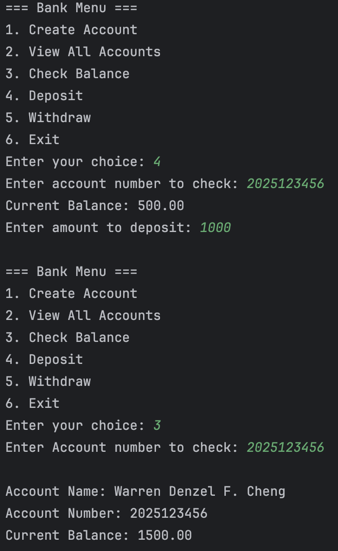
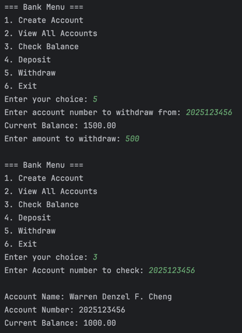
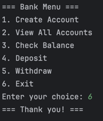

# Warren Denzel F. Cheng

## Lab 1: Build a Java Bank Account System

Create Account Output:  

View All Accounts Output:  

Check Balance Output:  

Deposit Output:  

Withdraw Output:  

Exit Output:  
